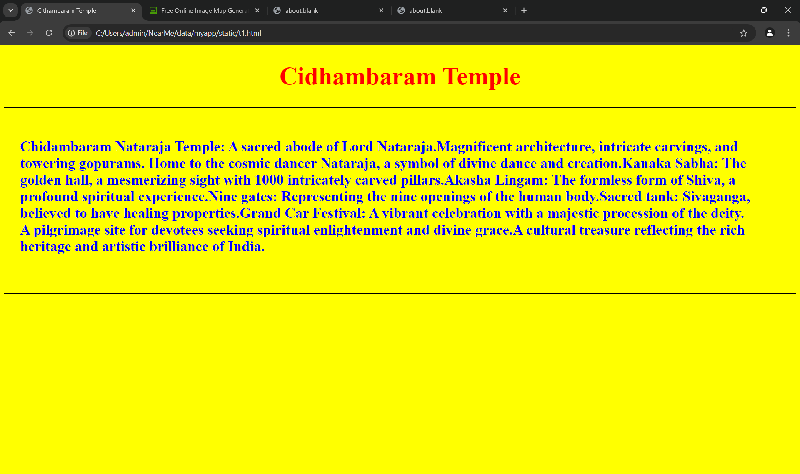
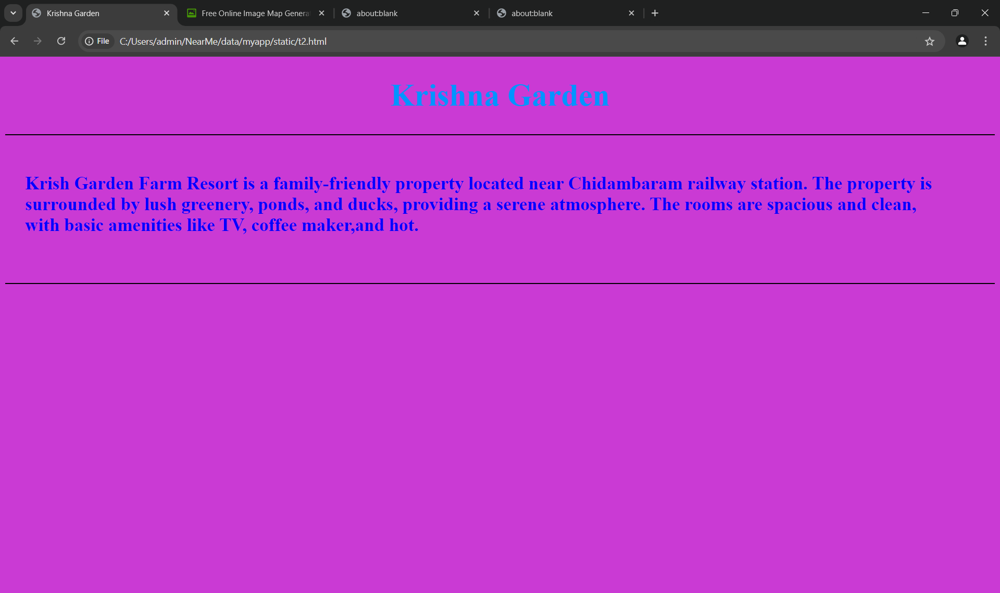
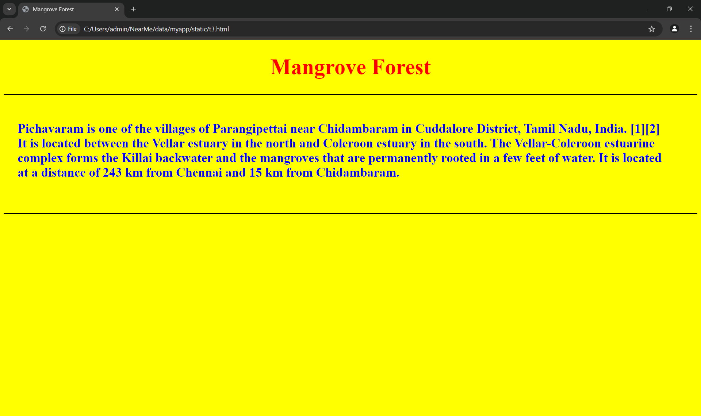
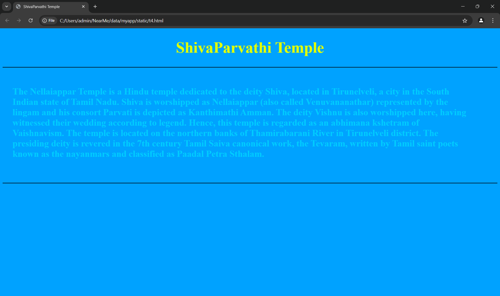
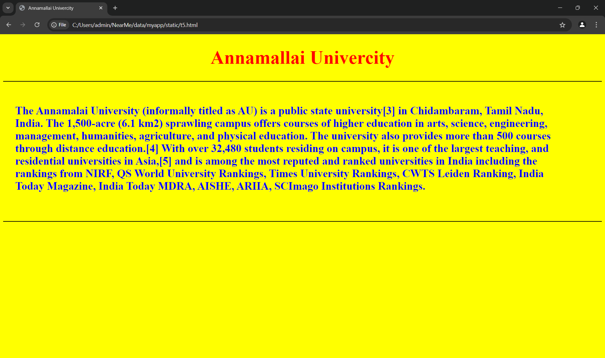

# Ex04 Places Around Me
## Date: 28.11.2024

## AIM
To develop a website to display details about the places around my house.

## DESIGN STEPS

### STEP 1
Create a Django admin interface.

### STEP 2
Download your city map from Google.

### STEP 3
Using ```<map>``` tag name the map.

### STEP 4
Create clickable regions in the image using ```<area>``` tag.

### STEP 5
Write HTML programs for all the regions identified.

### STEP 6
Execute the programs and publish them.

## CODE
```
map.html
<!DOCTYPE html>
<html lang="en">
<head>
<meta charset="UTF-8">
<meta name="viewport" content="width=device-width, initial-scale=1.0">
<title>My Home Town</title>
<style>
img{
padding-top: 1%;
}
h1{
          text-align: center;
          font-size: 48px;
          color: white;
      }
      body{
          background-color: rgb(106, 17, 250);
      }
  </style>
</head>
<body>
  <h1>My Home Town</h1>
  <center>
   <area target="" coords="545,414,766,295" alt="Chidhambaram Temple" title="Chidhambaram Temple"
   <area target="" alt="Krish Garden Farm Resort" title="Krish Garden Farm Resort" 
   <area target="" coords="1186,575,1407,456" alt="mangrove Forest" title="mangrove Forest"
   <area target="" alt="Thirunelvelishivaparvathi temple" title="Thirunelvelishivaparvathi temple"
   <area target="" alt="Annamalai Univercity" title="Annamalai Univercity"
</map>
</body>
</html>
t1.html
<!DOCTYPE html>
<html lang="en">
<head>
   <meta charset="UTF-8">
   <meta name="viewport" content="width=device-width, initial-scale=1.0">
   <title>Cithambaram Temple</title>
   <style>
       h1 {
           color: red;
           text-align: center;
           font-size: 48px;
       }
       p {
           padding-top: 2%;
           font-size: 28px;
           padding-right: 5%;
           padding-left: 2%;
           color: blue;
       }
       body {
           background-color: yellow;
       }
   </style>
</head>
<body>
   <h1>Cidhambaram Temple</h1>
   <hr color="black">
   <p><b>
    Chidambaram Nataraja Temple: A sacred abode of Lord Nataraja.Magnificent architecture, intricate carvings, and towering gopurams.
    Home to the cosmic dancer Nataraja, a symbol of divine dance and creation.Kanaka Sabha: The golden hall, a mesmerizing sight with 
    1000 intricately carved pillars.Akasha Lingam: The formless form of Shiva, a profound spiritual experience.Nine gates: Representing 
    the nine openings of the human body.Sacred tank: Sivaganga, believed to have healing properties.Grand Car Festival: A vibrant celebration 
    with a majestic procession of the deity. A pilgrimage site for devotees seeking spiritual enlightenment and divine grace.A cultural treasure
    reflecting the rich heritage and artistic brilliance of India.
       </b></p>
   <br><br>
   <hr color="black">
</body>
</html>
t2.html
<!DOCTYPE html>
<html lang="en">
<head>
   <meta charset="UTF-8">
   <meta name="viewport" content="width=device-width, initial-scale=1.0">
   <title>Krishna Garden</title>
   <style>
       h1 {
           color: rgb(0, 149, 255);
           text-align: center;
           font-size: 48px;
       }
       p {
           padding-top: 2%;
           font-size: 28px;
           padding-right: 5%;
           padding-left: 2%;
           color: blue;
       }
       body {
           background-color: rgb(202, 58, 212);
       }
   </style>
</head>
<body>
   <h1>Krishna Garden</h1>
   <hr color="black">
   <p><b>
    Krish Garden Farm Resort is a family-friendly property located near Chidambaram railway station.
     The property is surrounded by lush greenery, ponds, and ducks, providing a serene atmosphere.
     The rooms are spacious and clean, with basic amenities like TV, coffee maker,and hot.
       </b></p>
   <br><br>
   <hr color="black">
</body>
t3.html
<!DOCTYPE html>
<html lang="en">
<head>
   <meta charset="UTF-8">
   <meta name="viewport" content="width=device-width, initial-scale=1.0">
   <title>Mangrove Forest</title>
   <style>
       h1 {
           color: red;
           text-align: center;
           font-size: 48px;
       }
       p {
           padding-top: 2%;
           font-size: 28px;
           padding-right: 5%;
           padding-left: 2%;
           color: blue;
       }
       body {
           background-color: yellow;
       }
   </style>
</head>
<body>
   <h1>Mangrove Forest</h1>
   <hr color="black">
   <p><b>
    Pichavaram is one of the villages of Parangipettai near Chidambaram in Cuddalore District, Tamil Nadu, India.
    [1][2] It is located between the Vellar estuary in the north and Coleroon estuary in the south. The Vellar-Coleroon estuarine complex forms the Killai backwater and the mangroves that are permanently rooted in a few feet of water.
     It is located at a distance of 243 km from Chennai and 15 km from Chidambaram.
       </b></p>
   <br><br>
   <hr color="black">
</body>
t4.html
<!DOCTYPE html>
<html lang="en">
<head>
   <meta charset="UTF-8">
   <meta name="viewport" content="width=device-width, initial-scale=1.0">
   <title>ShivaParvathi Temple</title>
   <style>
       h1 {
           color: rgb(225, 255, 0);
           text-align: center;
           font-size: 48px;
       }
       p {
           padding-top: 2%;
           font-size: 28px;
           padding-right: 5%;
           padding-left: 2%;
           color: rgb(0, 204, 255);
       }
       body {
           background-color: rgb(0, 162, 255);
       }
   </style>
</head>
<body>
   <h1>ShivaParvathi Temple</h1>
   <hr color="black">
   <p><b>
    The Nellaiappar Temple is a Hindu temple dedicated to the deity Shiva, located in Tirunelveli, 
    a city in the South Indian state of Tamil Nadu. Shiva is worshipped as Nellaiappar (also called
     Venuvananathar) represented by the lingam and his consort Parvati is depicted as Kanthimathi Amman.
      The deity Vishnu is also worshipped here, having witnessed their wedding according to legend. Hence,
       this temple is regarded as an abhimana kshetram of Vaishnavism. The temple is located on the northern
        banks of Thamirabarani River in Tirunelveli district. The presiding deity is revered in the 7th century 
        Tamil Saiva canonical work, the Tevaram, written by Tamil saint poets known as the nayanmars and classified
         as Paadal Petra Sthalam.
       </b></p>
   <br><br>
   <hr color="black">
</body>
t5.html
<!DOCTYPE html>
<html lang="en">
<head>
   <meta charset="UTF-8">
   <meta name="viewport" content="width=device-width, initial-scale=1.0">
   <title>Annamallai Univercity</title>
   <style>
       h1 {
           color: red;
           text-align: center;
           font-size: 48px;
       }
       p {
           padding-top: 2%;
           font-size: 28px;
           padding-right: 5%;
           padding-left: 2%;
           color: blue;
       }
       body {
           background-color: yellow;
       }
   </style>
</head>
<body>
   <h1>Annamallai Univercity</h1>
   <hr color="black">
   <p><b>
    The Annamalai University (informally titled as AU) is a public state university[3] in Chidambaram, Tamil Nadu, India.
     The 1,500-acre (6.1 km2) sprawling campus offers courses of higher education in arts, science, engineering, management,
      humanities, agriculture, and physical education. The university also provides more than 500 courses through distance
       education.[4] With over 32,480 students residing on campus, it is one of the largest teaching, and residential universities
        in Asia,[5] and is among the most reputed and ranked universities in India including the rankings from NIRF, QS World 
        University Rankings, Times University Rankings, CWTS Leiden Ranking, India Today Magazine, India Today MDRA, AISHE, ARIIA,
         SCImago Institutions Rankings.
       </b></p>
   <br><br>
   <hr color="black">
</body>
```


## OUTPUT







## RESULT
The program for implementing image maps using HTML is executed successfully.
